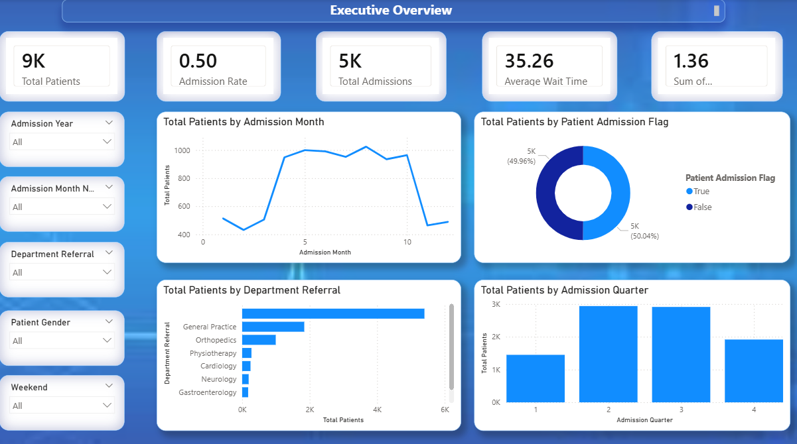
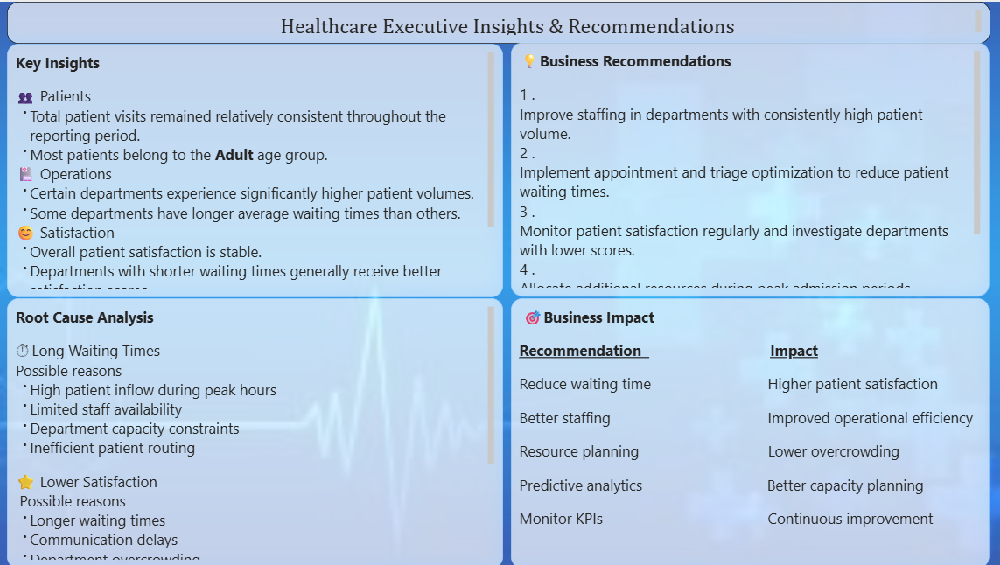

# 🏥 Healthcare Analytics And Dashboard

> **End-to-End Healthcare Business Intelligence Solution using Python, MySQL, SQL, and Power BI**

An end-to-end Healthcare Analytics project that transforms raw hospital data into actionable business insights through data cleaning, SQL analytics, and interactive Power BI dashboards.

This project demonstrates a complete Business Intelligence workflow used by data analysts to support hospital operations, patient management, and executive decision-making.

---

## 📌 Project Overview

Healthcare organizations generate large volumes of patient and operational data every day. Without proper analysis, valuable insights remain hidden.

This project analyzes hospital data to answer key business questions such as:

- How are patient admissions changing over time?
- Which departments receive the highest patient volume?
- Which patient demographics require greater attention?
- How long are patients waiting for treatment?
- How satisfied are patients with hospital services?
- What operational improvements can increase efficiency?

The final outcome is an interactive executive dashboard designed for healthcare management.

---

## 🛠 Technology Stack

- Python
- Pandas
- NumPy
- MySQL
- SQL
- Power BI
- DAX

---

## 📂 Project Workflow

Raw Dataset

↓

Data Cleaning & Preprocessing (Python)

↓

Feature Engineering

↓

MySQL Database

↓

SQL Analysis & Business Views

↓

Power BI Dashboard

↓

Business Insights & Executive Recommendations

---

## 📊 Dashboard Pages

### 1️⃣ Executive Overview

Provides a high-level summary of hospital performance including:

- Total Patients
- Total Admissions
- Admission Rate
- Average Waiting Time
- Monthly Admission Trend
- Department-wise Patient Volume

---

### 2️⃣ Patient Intelligence

Analyzes patient demographics and satisfaction.

Includes:

- Gender Distribution
- Age Group Analysis
- Race Distribution
- Patient Satisfaction
- Admission Analysis
- Patient Segmentation

---

### 3️⃣ Hospital Operations

Evaluates operational efficiency.

Includes:

- Department Performance
- Waiting Time Analysis
- Admission Trends
- Weekend vs Weekday Analysis
- Department Satisfaction
- Operational KPIs

---

### 4️⃣ Executive Insights & Recommendations

Transforms analytical findings into business decisions by presenting:

- Key Insights
- Root Cause Analysis
- Business Recommendations
- Expected Business Impact

---
## 📸 Dashboard Preview

### Executive Overview



---

### Patient Intelligence


---

### Hospital Operations


---

### Executive Insights & Recommendations



---

## 🔍 Business Insights

- Patient admissions remained stable across the reporting period.
- Adult patients represent the largest patient population.
- Certain departments consistently experience higher patient volumes.
- Waiting times vary significantly across departments.
- Patient satisfaction differs based on operational performance.
- Resource allocation opportunities were identified through operational analysis.

---

## 💡 Business Recommendations

- Improve staffing in high-demand departments.
- Reduce patient waiting times through workflow optimization.
- Monitor patient satisfaction regularly.
- Allocate hospital resources based on admission trends.
- Track operational KPIs for continuous improvement.

---

## 📈 Skills Demonstrated

✔ Data Cleaning

✔ Exploratory Data Analysis

✔ Feature Engineering

✔ SQL Query Writing

✔ SQL Views

✔ Business KPI Development

✔ Power BI Dashboard Design

✔ DAX Measures

✔ Data Visualization

✔ Business Intelligence

✔ Healthcare Analytics

✔ Executive Reporting

---

## 📁 Repository Structure

```
Healthcare-Analytics-Dashboard/
│
├── Data/
├── Python/
├── SQL/
├── Power BI/
├── Dashboard Screenshots/
├── README.md
└── requirements.txt
```

---

## 🚀 Key Outcomes

- Built an end-to-end analytics pipeline from raw healthcare data to executive dashboards.
- Developed interactive reports for hospital management.
- Generated business recommendations using data-driven insights.
- Demonstrated practical experience with Python, SQL, MySQL, Power BI, and DAX.

---

## 👨‍💻 Author

**Mirali Unagar**

Aspiring Data Analyst | Python | SQL | Power BI | Business Intelligence
